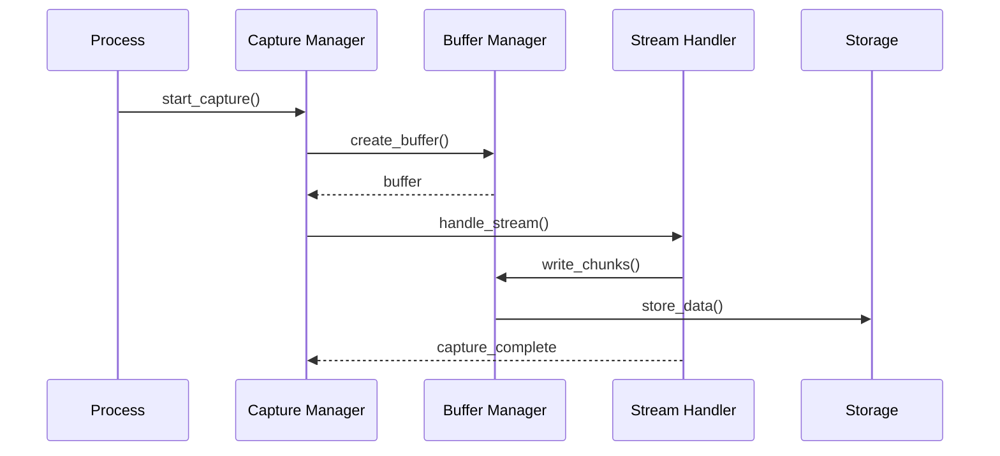
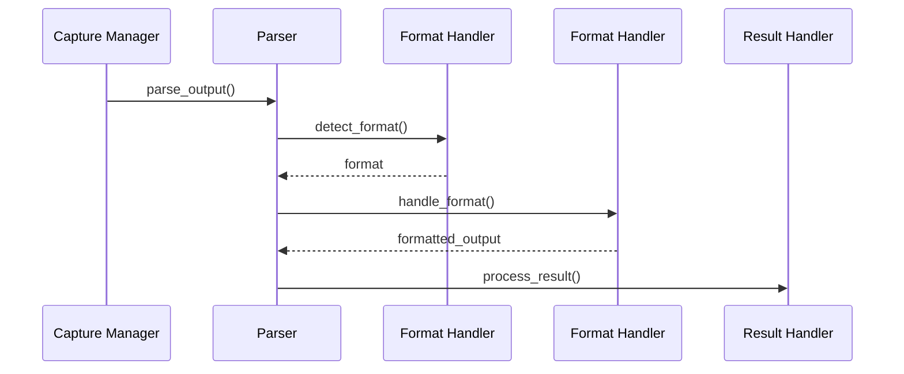

# Command Output Capture and Parsing Design

## System Overview

### Purpose
Design a robust and efficient system for capturing, processing, and parsing command output while maintaining high performance and reliability.

### Scope
- Output stream capture
- Output processing
- Format parsing
- Data management

## Architecture

### High-Level Component Diagram
```
┌────────────────────────────────────┐
│      Output Processing System      │
└──────────────────┬─────────────────┘
         ┌─────────┴─────────┐
         ▼                   ▼
┌─────────────────┐   ┌──────────────────┐
│ Stream Capture  │   │  Output Parser   │
└───────┬─────────┘   └────────┬─────────┘
        │                      │
    ┌───┴──────────────────────┴───┐
    ▼                              ▼
┌─────────┐                  ┌──────────┐
│ Buffer  │                  │ Format   │
│ Manager │                  │ Handler  │
└────┬────┘                  └────┬─────┘
     │                            │
     └────────────────────────────┘
```

## Component Design

### 1. Stream Capture Manager
```python
class StreamCaptureManager:
    def __init__(self):
        self.buffer_manager = BufferManager()
        self.stream_handlers = {}
        self.active_captures = {}

    async def capture_stream(
        self,
        stream: IOStream,
        options: CaptureOptions
    ) -> CaptureHandle:
        """
        Initialize stream capture.
        """
        try:
            # Create capture context
            context = await self._create_capture_context(
                stream, options
            )
            
            # Initialize buffer
            buffer = await self.buffer_manager.create_buffer(
                context
            )
            
            # Start capture
            handle = await self._start_capture(context, buffer)
            self.active_captures[handle] = context
            
            return handle
            
        except CaptureError as e:
            await self._handle_capture_error(e)

    async def _process_stream(
        self,
        stream: IOStream,
        buffer: Buffer,
        context: CaptureContext
    ):
        """
        Process stream data.
        """
        while True:
            try:
                # Read chunk
                chunk = await stream.read(context.chunk_size)
                if not chunk:
                    break
                    
                # Process chunk
                processed = await self._process_chunk(
                    chunk, context
                )
                
                # Store in buffer
                await buffer.write(processed)
                
                # Check limits
                await self._check_limits(buffer, context)
                
            except StreamError as e:
                await self._handle_stream_error(e, context)
```

### 2. Buffer Manager
```python
class BufferManager:
    def __init__(self):
        self.buffers: Dict[str, Buffer] = {}
        self.stats = BufferStats()

    async def create_buffer(
        self,
        context: CaptureContext
    ) -> Buffer:
        """
        Create output buffer.
        """
        try:
            # Initialize buffer
            buffer = Buffer(
                max_size=context.max_buffer_size,
                mode=context.buffer_mode
            )
            
            # Register buffer
            buffer_id = str(uuid.uuid4())
            self.buffers[buffer_id] = buffer
            
            # Start monitoring
            await self._start_monitoring(buffer_id)
            
            return buffer
            
        except BufferError as e:
            await self._handle_buffer_error(e)

    async def write_to_buffer(
        self,
        buffer_id: str,
        data: bytes
    ) -> int:
        """
        Write data to buffer.
        """
        try:
            buffer = self.buffers[buffer_id]
            
            # Check capacity
            if not await self._check_capacity(buffer, len(data)):
                await self._handle_overflow(buffer)
                
            # Write data
            bytes_written = await buffer.write(data)
            
            # Update stats
            self.stats.record_write(bytes_written)
            
            return bytes_written
            
        except BufferError as e:
            await self._handle_buffer_error(e)
```

### 3. Output Parser
```python
class OutputParser:
    def __init__(self):
        self.format_handlers = FormatHandlerRegistry()
        self.parser_cache = ParserCache()

    async def parse_output(
        self,
        data: bytes,
        format: Optional[OutputFormat] = None
    ) -> ParseResult:
        """
        Parse output data.
        """
        try:
            # Detect format if not specified
            if not format:
                format = await self._detect_format(data)
                
            # Get parser
            parser = await self._get_parser(format)
            
            # Parse data
            result = await parser.parse(data)
            
            # Validate result
            if not await self._validate_result(result):
                raise ParseError("Invalid parse result")
                
            return ParseResult(result, format)
            
        except ParseError as e:
            await self._handle_parse_error(e)

    async def _detect_format(
        self,
        data: bytes
    ) -> OutputFormat:
        """
        Detect output format.
        """
        # Check cache
        cached = self.parser_cache.get_format(data)
        if cached:
            return cached
            
        # Try format detection
        for detector in self.format_handlers.detectors:
            if await detector.can_handle(data):
                return detector.format
                
        return OutputFormat.RAW
```

### 4. Format Handler
```python
class FormatHandler:
    def __init__(self):
        self.handlers = {}
        self.converters = {}

    async def handle_format(
        self,
        data: bytes,
        format: OutputFormat
    ) -> FormattedOutput:
        """
        Handle specific output format.
        """
        try:
            # Get handler
            handler = self._get_handler(format)
            
            # Process data
            processed = await handler.process(data)
            
            # Format output
            formatted = await handler.format(processed)
            
            return FormattedOutput(
                content=formatted,
                format=format
            )
            
        except FormatError as e:
            await self._handle_format_error(e)

    async def convert_format(
        self,
        data: FormattedOutput,
        target_format: OutputFormat
    ) -> FormattedOutput:
        """
        Convert between formats.
        """
        try:
            # Get converter
            converter = self._get_converter(
                data.format,
                target_format
            )
            
            # Convert data
            converted = await converter.convert(data.content)
            
            return FormattedOutput(
                content=converted,
                format=target_format
            )
            
        except ConversionError as e:
            await self._handle_conversion_error(e)
```

## Data Flow

### Capture Flow


### Parse Flow


## Error Handling

### Error Hierarchy
```
OutputError
├── CaptureError
│   ├── StreamError
│   └── BufferError
├── ParseError
│   ├── FormatError
│   └── ValidationError
└── ProcessingError
    ├── OverflowError
    └── TimeoutError
```

### Recovery Strategies
1. **Stream Errors**
   - Retry mechanism
   - Partial capture
   - Error reporting
   - State recovery

2. **Buffer Overflow**
   - Auto-flush
   - Size management
   - Data persistence
   - Flow control

## Performance Optimizations

### 1. Buffer Management
- Circular buffers
- Memory mapping
- Chunk optimization
- Buffer pooling

### 2. Parse Optimization
- Format caching
- Parser pooling
- Lazy parsing
- Incremental processing

### 3. Resource Management
- Stream throttling
- Memory limits
- CPU optimization
- I/O efficiency

## Monitoring

### Key Metrics
1. **Capture Metrics**
   - Throughput
   - Latency
   - Error rates
   - Buffer usage

2. **Parse Metrics**
   - Parse speed
   - Success rate
   - Format distribution
   - Resource usage

### Implementation
```python
class OutputMetrics:
    def __init__(self):
        self.metrics = MetricsCollector()
        self.logger = MetricsLogger()

    def record_metrics(
        self,
        metrics: Dict[str, Any]
    ):
        """
        Record output processing metrics.
        """
        self.metrics.record(metrics)
        self.logger.log_metrics(metrics)

    def generate_report(self) -> MetricsReport:
        """
        Generate metrics report.
        """
        return self.metrics.generate_report()
```

This high-level design provides a foundation for implementing robust and efficient command output capture and parsing while maintaining system performance and reliability.
