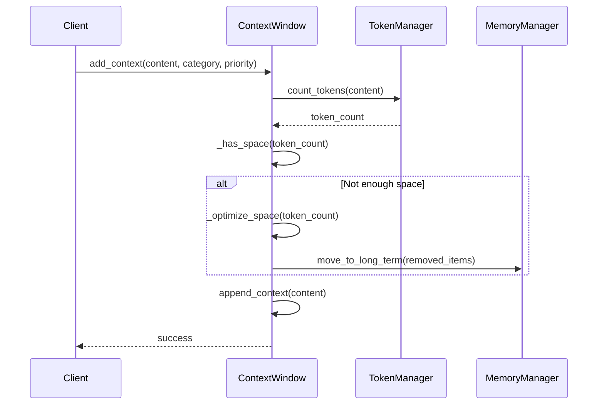

# Context Window Management System Design

## System Overview

### Purpose
Design a system to efficiently manage and maintain contextual information for AI operations within a limited token window, ensuring optimal use of available context space while preserving the most relevant information.

### Scope
- Token counting and management
- Context prioritization
- Basic memory operations
- Error handling

## Architecture

### Component Diagram
```
┌─────────────────────────────────────┐
│        Context Window Manager       │
├─────────────────────────────────────┤
│ - Max tokens                        │
│ - Current tokens                    │
│ - Context categories                │
│ - Priority levels                   │
└───────────────┬─────────────────────┘
                │
        ┌───────┴───────┐
        ▼               ▼
┌──────────────┐  ┌──────────────┐
│   Memory     │  │    Token     │
│   Manager    │  │   Manager    │
└──────────────┘  └──────────────┘
```

### Class Design

```python
from dataclasses import dataclass
from datetime import datetime
from enum import Enum
from typing import Dict, List, Optional

class Priority(Enum):
    CRITICAL = 0  # System prompts, current command
    HIGH = 1      # Active file, recent conversation
    MEDIUM = 2    # Related files, project context
    LOW = 3       # Historical data

class Category(Enum):
    SYSTEM = "system"
    USER = "user"
    CODE = "code"
    MEMORY = "memory"

@dataclass
class ContextItem:
    content: str
    category: Category
    priority: Priority
    tokens: int
    timestamp: datetime
    metadata: Optional[Dict] = None

class TokenManager:
    def __init__(self, model_name: str):
        self.model_name = model_name
        self.tokenizer = self._load_tokenizer()
    
    def count_tokens(self, text: str) -> int:
        pass
    
    def _load_tokenizer(self):
        pass

class MemoryManager:
    def __init__(self):
        self.short_term: List[ContextItem] = []
        self.long_term: Dict[str, ContextItem] = {}
    
    def add_to_short_term(self, item: ContextItem):
        pass
    
    def move_to_long_term(self, item: ContextItem):
        pass

class ContextWindow:
    def __init__(
        self,
        max_tokens: int = 4096,
        buffer_ratio: float = 0.2
    ):
        self.max_tokens = max_tokens
        self.buffer_tokens = int(max_tokens * buffer_ratio)
        self.current_tokens = 0
        self.token_manager = TokenManager("gpt-4")
        self.memory_manager = MemoryManager()
        self.contexts: Dict[Category, List[ContextItem]] = {
            cat: [] for cat in Category
        }

    def add_context(
        self,
        content: str,
        category: Category,
        priority: Priority
    ) -> bool:
        tokens = self.token_manager.count_tokens(content)
        if not self._has_space(tokens):
            self._optimize_space(tokens)
        
        item = ContextItem(
            content=content,
            category=category,
            priority=priority,
            tokens=tokens,
            timestamp=datetime.now()
        )
        
        self.contexts[category].append(item)
        self.current_tokens += tokens
        return True

    def _has_space(self, required_tokens: int) -> bool:
        return (self.current_tokens + required_tokens) <= (
            self.max_tokens - self.buffer_tokens
        )

    def _optimize_space(self, required_tokens: int):
        """Remove low-priority contexts until there's enough space."""
        for priority in reversed(Priority):
            for category in Category:
                items = self.contexts[category]
                items.sort(key=lambda x: (x.priority.value, -x.timestamp.timestamp()))
                
                while (
                    items and 
                    items[0].priority.value >= priority.value and
                    not self._has_space(required_tokens)
                ):
                    removed = items.pop(0)
                    self.current_tokens -= removed.tokens
                    if priority.value <= Priority.MEDIUM.value:
                        self.memory_manager.move_to_long_term(removed)
```

## Interaction Flow

### Adding Context


## Data Structures

### Context Item
```json
{
    "content": "string",
    "category": "SYSTEM|USER|CODE|MEMORY",
    "priority": "CRITICAL|HIGH|MEDIUM|LOW",
    "tokens": "integer",
    "timestamp": "datetime",
    "metadata": {
        "file_path": "string",
        "language": "string",
        "source": "string"
    }
}
```

## Error Handling

### Error Types
1. `ContextOverflowError`: When unable to make space for new context
2. `InvalidContextError`: When context content or category is invalid
3. `TokenizationError`: When token counting fails

### Error Handling Flow
```python
try:
    context_window.add_context(content, category, priority)
except ContextOverflowError:
    logger.error("Unable to add context: insufficient space")
    # Fall back to emergency context clearing
except InvalidContextError as e:
    logger.error(f"Invalid context: {e}")
    # Request valid context from client
except TokenizationError:
    logger.error("Failed to tokenize content")
    # Use approximate token count
```

## Performance Considerations

### Optimization Strategies
1. **Token Counting**
   - Cache token counts for frequent content
   - Use approximate counting for large content
   - Batch token counting operations

2. **Memory Management**
   - Implement LRU cache for short-term memory
   - Use async operations for long-term storage
   - Compress stored contexts

3. **Context Optimization**
   - Implement priority-based garbage collection
   - Use sliding window for conversation history
   - Maintain token usage histograms

## Monitoring

### Key Metrics
1. **Usage Metrics**
   - Current token count
   - Token utilization ratio
   - Context category distribution
   - Priority level distribution

2. **Performance Metrics**
   - Token counting latency
   - Context addition latency
   - Optimization frequency
   - Memory operation latency

### Monitoring Implementation
```python
@dataclass
class ContextMetrics:
    total_tokens: int
    utilization_ratio: float
    category_distribution: Dict[Category, int]
    priority_distribution: Dict[Priority, int]
    operation_latencies: Dict[str, float]

def collect_metrics(self) -> ContextMetrics:
    return ContextMetrics(
        total_tokens=self.current_tokens,
        utilization_ratio=self.current_tokens / self.max_tokens,
        category_distribution=self._get_category_distribution(),
        priority_distribution=self._get_priority_distribution(),
        operation_latencies=self._get_operation_latencies()
    )
```

This design provides a foundation for implementing basic context window management with room for future enhancements and optimizations.
