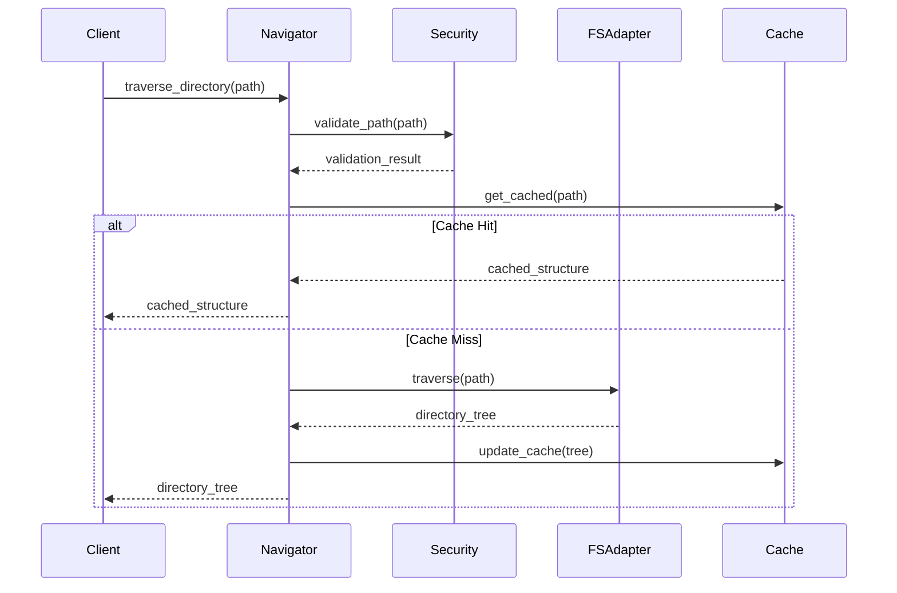
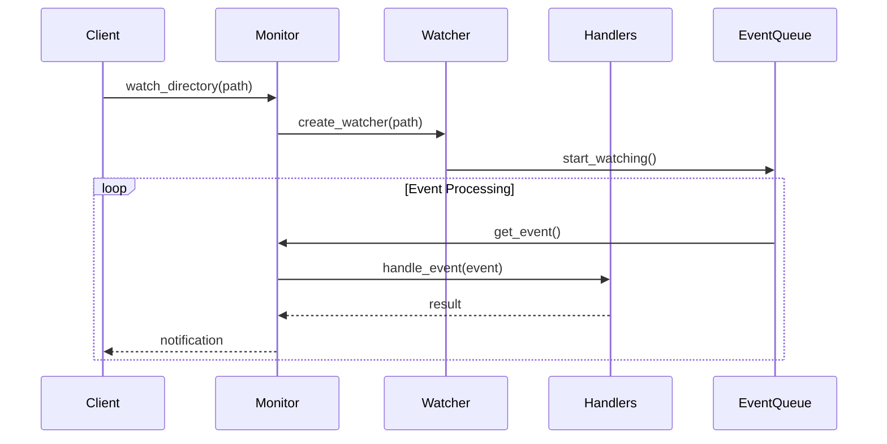

# Directory Management System Design

## System Overview

### Purpose
Design a robust and efficient directory management system that provides secure traversal, monitoring, and management capabilities for the Cascade AI assistant.

### Scope
- Directory traversal and navigation
- File system monitoring
- Project structure analysis
- Workspace management

## Architecture

### High-Level Component Diagram
```
┌────────────────────────────────────┐
│      Directory Management          │
│            System                  │
└──────────────────┬─────────────────┘
         ┌─────────┴─────────┐
         ▼                   ▼
┌─────────────────┐   ┌──────────────────┐
│   Navigator     │   │    Monitor       │
└───────┬─────────┘   └────────┬─────────┘
        │                      │
    ┌───┴──────────────────────┴───┐
    ▼                              ▼
┌─────────┐                  ┌──────────┐
│ Cache   │                  │ Project  │
│ Manager │                  │ Analyzer │
└────┬────┘                  └────┬─────┘
     │                            │
     └────────────────────────────┘
```

## Component Design

### 1. Navigator
```python
class DirectoryNavigator:
    def __init__(self):
        self.path_resolver = PathResolver()
        self.cache_manager = CacheManager()
        self.security_checker = SecurityChecker()
        self.fs_adapter = FileSystemAdapter()

    async def traverse_directory(
        self,
        path: str,
        options: TraversalOptions
    ) -> DirectoryTree:
        """
        Traverse directory with specified options.
        """
        try:
            # Resolve and validate path
            resolved_path = self.path_resolver.resolve(path)
            self.security_checker.validate_path(resolved_path)
            
            # Check cache
            if cached := self.cache_manager.get(resolved_path):
                return cached
            
            # Perform traversal
            tree = await self.fs_adapter.traverse(
                resolved_path,
                options
            )
            
            # Update cache
            self.cache_manager.set(resolved_path, tree)
            
            return tree
            
        except DirectoryError as e:
            await self.handle_error(e)
```

### 2. Monitor
```python
class DirectoryMonitor:
    def __init__(self):
        self.watchers = {}
        self.event_queue = asyncio.Queue()
        self.handlers = EventHandlerRegistry()

    async def watch_directory(
        self,
        path: str,
        options: WatchOptions
    ) -> WatchHandle:
        """
        Set up directory watching.
        """
        watcher = FileSystemWatcher(path, options)
        await watcher.start()
        self.watchers[path] = watcher
        return WatchHandle(watcher)

    async def process_events(self):
        """
        Process file system events.
        """
        while True:
            event = await self.event_queue.get()
            await self.handlers.handle(event)
```

### 3. Cache Manager
```python
class CacheManager:
    def __init__(self):
        self.directory_cache = LRUCache()
        self.metadata_cache = TTLCache()
        self.stats = CacheStats()

    def get_cached_structure(
        self,
        path: str
    ) -> Optional[DirectoryTree]:
        """
        Get cached directory structure.
        """
        pass

    def update_cache(
        self,
        path: str,
        structure: DirectoryTree
    ) -> None:
        """
        Update cache with new structure.
        """
        pass
```

### 4. Project Analyzer
```python
class ProjectAnalyzer:
    def __init__(self):
        self.detectors = ProjectDetectorRegistry()
        self.analyzers = {
            'npm': NpmAnalyzer(),
            'pip': PipAnalyzer(),
            'maven': MavenAnalyzer()
        }

    async def analyze_project(
        self,
        root_path: str
    ) -> ProjectStructure:
        """
        Analyze project structure and dependencies.
        """
        # Detect project type
        project_type = await self.detectors.detect(root_path)
        
        # Get appropriate analyzer
        analyzer = self.analyzers.get(project_type)
        if not analyzer:
            raise UnsupportedProjectError(project_type)
            
        # Perform analysis
        return await analyzer.analyze(root_path)
```

## Data Flow

### Directory Traversal


### Directory Monitoring


## Error Handling

### Error Hierarchy
```
DirectoryError
├── NavigationError
│   ├── PathError
│   └── AccessError
├── MonitoringError
│   ├── WatchError
│   └── EventError
└── AnalysisError
    ├── DetectionError
    └── ParseError
```

### Recovery Strategies
1. **Automatic Retry**
   - Transient errors
   - Watch failures
   - Cache updates

2. **Fallback Mechanisms**
   - Alternative paths
   - Default structures
   - Cache recovery

## Caching Strategy

### Cache Structure
```python
@dataclass
class CacheEntry:
    path: str
    structure: DirectoryTree
    metadata: Dict
    timestamp: datetime
    ttl: int

class DirectoryCache:
    def __init__(self, max_size: int = 1000):
        self.cache = LRUCache(max_size)
        self.stats = CacheStats()

    def get(
        self,
        path: str,
        max_age: int = 300
    ) -> Optional[DirectoryTree]:
        """
        Get cached directory structure if not expired.
        """
        pass

    def set(
        self,
        path: str,
        structure: DirectoryTree,
        ttl: int = 300
    ) -> None:
        """
        Cache directory structure with TTL.
        """
        pass
```

## Performance Optimizations

### 1. Traversal Optimization
- Lazy loading
- Parallel traversal
- Filtered scanning
- Path exclusions

### 2. Monitoring Optimization
- Event batching
- Debounced updates
- Selective watching
- Resource pooling

### 3. Cache Optimization
- Two-level caching
- Predictive loading
- Background refresh
- Partial updates

## Security Measures

### 1. Path Validation
```python
class PathValidator:
    def validate(
        self,
        path: str,
        context: SecurityContext
    ) -> bool:
        """
        Validate path security:
        - No traversal
        - Within workspace
        - Proper permissions
        """
        pass
```

### 2. Access Control
```python
class AccessController:
    def check_access(
        self,
        path: str,
        operation: Operation,
        context: SecurityContext
    ) -> bool:
        """
        Check operation permissions:
        - Read/write access
        - Directory listing
        - File creation
        """
        pass
```

## Monitoring System

### Key Metrics
1. **Performance**
   - Traversal time
   - Event latency
   - Cache efficiency
   - Memory usage

2. **Operations**
   - Access patterns
   - Event frequency
   - Error rates
   - Cache hits/misses

### Implementation
```python
class DirectoryMetrics:
    def __init__(self):
        self.metrics = MetricsCollector()
        self.logger = OperationLogger()

    def record_operation(
        self,
        operation: Operation,
        result: OperationResult
    ) -> None:
        """
        Record operation metrics.
        """
        pass

    def generate_report(
        self
    ) -> MetricsReport:
        """
        Generate metrics report.
        """
        pass
```

This high-level design provides a foundation for implementing a robust, secure, and efficient directory management system while maintaining modularity and extensibility.
