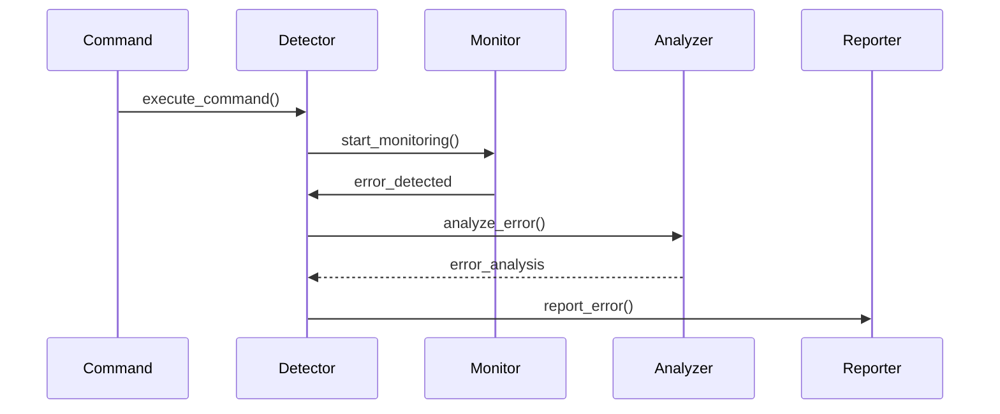
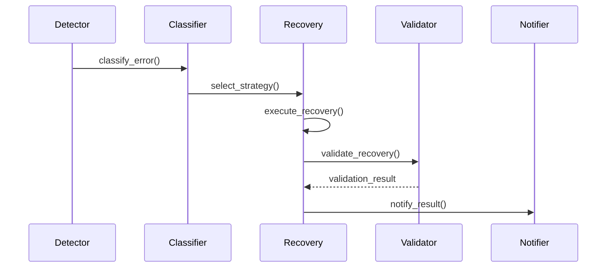

# Command Error Handling System Design

## System Overview

### Purpose
Design a comprehensive error handling system that detects, classifies, and manages command execution errors while providing effective recovery mechanisms.

### Scope
- Error detection
- Error classification
- Error recovery
- Error reporting

## Architecture

### High-Level Component Diagram
```
┌────────────────────────────────────┐
│       Error Handling System        │
└──────────────────┬─────────────────┘
         ┌─────────┴─────────┐
         ▼                   ▼
┌─────────────────┐   ┌──────────────────┐
│ Error Detector  │   │ Error Classifier │
└───────┬─────────┘   └────────┬─────────┘
        │                      │
    ┌───┴──────────────────────┴───┐
    ▼                              ▼
┌─────────┐                  ┌──────────┐
│Recovery │                  │ Reporter │
│Manager  │                  │ Manager  │
└────┬────┘                  └────┬─────┘
     │                            │
     └────────────────────────────┘
```

## Component Design

### 1. Error Detector
```python
class ErrorDetector:
    def __init__(self):
        self.monitors = MonitorRegistry()
        self.detectors = DetectorRegistry()
        self.context = ContextManager()

    async def detect_errors(
        self,
        command: Command,
        context: ExecutionContext
    ) -> List[DetectedError]:
        """
        Detect command execution errors.
        """
        try:
            errors = []
            
            # Check command validity
            command_errors = await self._check_command(command)
            errors.extend(command_errors)
            
            # Check system state
            system_errors = await self._check_system_state()
            errors.extend(system_errors)
            
            # Check resources
            resource_errors = await self._check_resources(
                command.requirements
            )
            errors.extend(resource_errors)
            
            return errors
            
        except Exception as e:
            await self._handle_detector_error(e)

    async def monitor_execution(
        self,
        process: Process,
        monitors: List[Monitor]
    ) -> AsyncIterator[DetectedError]:
        """
        Monitor process execution for errors.
        """
        try:
            for monitor in monitors:
                await monitor.start(process)
                
            while process.is_running():
                for monitor in monitors:
                    if await monitor.has_error():
                        yield await monitor.get_error()
                        
                await asyncio.sleep(0.1)
                
        finally:
            for monitor in monitors:
                await monitor.stop()
```

### 2. Error Classifier
```python
class ErrorClassifier:
    def __init__(self):
        self.rules = RuleEngine()
        self.analyzers = AnalyzerRegistry()
        self.history = ErrorHistory()

    async def classify_error(
        self,
        error: DetectedError,
        context: ExecutionContext
    ) -> ErrorClassification:
        """
        Classify detected error.
        """
        try:
            # Apply classification rules
            classification = await self.rules.apply(error)
            
            # Analyze error context
            analysis = await self._analyze_error(error, context)
            
            # Update classification with analysis
            classification.update(analysis)
            
            # Record in history
            await self.history.record(classification)
            
            return classification
            
        except ClassificationError as e:
            await self._handle_classification_error(e)

    async def _analyze_error(
        self,
        error: DetectedError,
        context: ExecutionContext
    ) -> ErrorAnalysis:
        """
        Analyze error details.
        """
        analysis = ErrorAnalysis()
        
        for analyzer in self.analyzers.get_matching(error):
            result = await analyzer.analyze(error, context)
            analysis.add_result(result)
            
        return analysis
```

### 3. Recovery Manager
```python
class RecoveryManager:
    def __init__(self):
        self.strategies = StrategyRegistry()
        self.executor = RecoveryExecutor()
        self.validator = RecoveryValidator()

    async def attempt_recovery(
        self,
        error: ClassifiedError,
        context: ExecutionContext
    ) -> RecoveryResult:
        """
        Attempt error recovery.
        """
        try:
            # Select recovery strategy
            strategy = await self._select_strategy(error)
            
            # Prepare recovery
            await self._prepare_recovery(strategy, context)
            
            # Execute recovery
            result = await self.executor.execute(
                strategy, context
            )
            
            # Validate recovery
            if not await self.validator.validate(result):
                raise RecoveryError("Recovery validation failed")
                
            return result
            
        except RecoveryError as e:
            await self._handle_recovery_error(e)

    async def _select_strategy(
        self,
        error: ClassifiedError
    ) -> RecoveryStrategy:
        """
        Select appropriate recovery strategy.
        """
        strategies = self.strategies.get_matching(error)
        
        # Sort by success probability
        strategies.sort(key=lambda s: s.success_probability)
        
        # Return highest probability strategy
        return strategies[0] if strategies else None
```

### 4. Reporter Manager
```python
class ReporterManager:
    def __init__(self):
        self.formatters = FormatterRegistry()
        self.notifiers = NotifierRegistry()
        self.storage = ReportStorage()

    async def report_error(
        self,
        error: ClassifiedError,
        context: ExecutionContext
    ) -> ErrorReport:
        """
        Generate and distribute error report.
        """
        try:
            # Generate report
            report = await self._generate_report(error, context)
            
            # Store report
            await self.storage.store(report)
            
            # Notify relevant parties
            await self._notify(report)
            
            return report
            
        except ReportError as e:
            await self._handle_report_error(e)

    async def _notify(self, report: ErrorReport):
        """
        Notify relevant parties about error.
        """
        for notifier in self.notifiers.get_matching(report):
            try:
                await notifier.notify(report)
            except NotificationError as e:
                await self._handle_notification_error(e)
```

## Error Flow

### Detection Flow


### Recovery Flow


## Error Handling

### Error Hierarchy
```
CommandError
├── ExecutionError
│   ├── ProcessError
│   └── ResourceError
├── SystemError
│   ├── StateError
│   └── EnvironmentError
└── RecoveryError
    ├── StrategyError
    └── ValidationError
```

### Recovery Strategies
1. **Process Recovery**
   - Process restart
   - State restoration
   - Resource reallocation
   - Cleanup procedures

2. **System Recovery**
   - Service restart
   - Resource reset
   - State synchronization
   - Environment reset

## Performance Optimizations

### 1. Detection Optimization
- Early detection
- Parallel monitoring
- Resource pooling
- Context caching

### 2. Recovery Optimization
- Strategy caching
- Parallel recovery
- Resource reuse
- State caching

### 3. Reporting Optimization
- Report batching
- Async notifications
- Storage optimization
- Format caching

## Monitoring

### Key Metrics
1. **Error Metrics**
   - Detection rate
   - Classification accuracy
   - Recovery success
   - Response time

2. **System Metrics**
   - Resource usage
   - Performance impact
   - Recovery time
   - System stability

### Implementation
```python
class ErrorMetrics:
    def __init__(self):
        self.metrics = MetricsCollector()
        self.logger = MetricsLogger()

    def record_error_metrics(
        self,
        metrics: Dict[str, Any]
    ):
        """
        Record error handling metrics.
        """
        self.metrics.record(metrics)
        self.logger.log_metrics(metrics)

    def generate_report(self) -> MetricsReport:
        """
        Generate metrics report.
        """
        return self.metrics.generate_report()
```

This high-level design provides a foundation for implementing robust error handling while maintaining system stability and performance.
