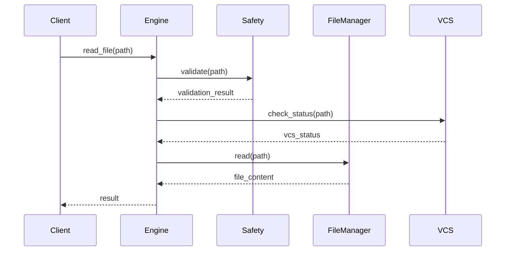
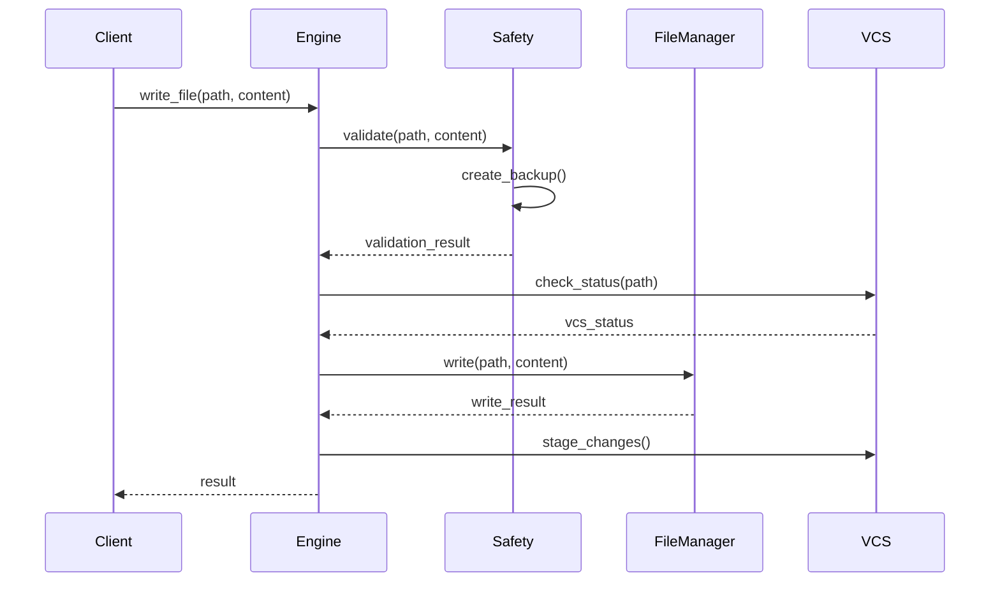

# File Operations System Design

## System Overview

### Purpose
Design a robust and secure file operations system that provides safe and efficient file reading, writing, and management capabilities for the Cascade AI assistant.

### Scope
- File system operations
- Code-aware modifications
- Safety and validation
- IDE integration

## Architecture

### High-Level Component Diagram
```
┌─────────────────────────────────────────┐
│            File Operations              │
│                 System                  │
└───────────────────┬─────────────────────┘
          ┌─────────┴─────────┐
          ▼                   ▼
┌─────────────────┐   ┌──────────────────┐
│   Core Engine   │   │  Safety Manager  │
└───────┬─────────┘   └────────┬─────────┘
        │                      │
    ┌───┴──────────────────────┴───┐
    ▼                              ▼
┌─────────┐                  ┌──────────┐
│  File   │                  │   VCS    │
│ Manager │                  │ Manager  │
└────┬────┘                  └────┬─────┘
     │                            │
     └────────────────────────────┘
```

## Component Design

### 1. Core Engine
```python
class FileOperationsEngine:
    def __init__(self):
        self.file_manager = FileManager()
        self.safety_manager = SafetyManager()
        self.vcs_manager = VCSManager()
        self.cache = OperationCache()

    async def execute_operation(
        self,
        operation: FileOperation
    ) -> OperationResult:
        """
        Execute file operation with safety checks and VCS awareness.
        """
        try:
            # Validate operation
            self.safety_manager.validate(operation)
            
            # Check VCS status
            self.vcs_manager.check_status(operation)
            
            # Execute operation
            result = await self.file_manager.execute(operation)
            
            # Update cache
            self.cache.update(operation, result)
            
            return result
            
        except FileOperationError as e:
            await self.handle_error(e)
```

### 2. File Manager
```python
class FileManager:
    async def read(
        self,
        path: str,
        options: ReadOptions
    ) -> FileContent:
        """
        Read file content with specified options.
        """
        pass

    async def write(
        self,
        path: str,
        content: FileContent,
        options: WriteOptions
    ) -> bool:
        """
        Write content to file with safety measures.
        """
        pass

    async def modify(
        self,
        path: str,
        changes: List[CodeChange],
        options: ModifyOptions
    ) -> bool:
        """
        Apply code changes with language awareness.
        """
        pass
```

### 3. Safety Manager
```python
class SafetyManager:
    def __init__(self):
        self.validators = {
            'path': PathValidator(),
            'content': ContentValidator(),
            'permission': PermissionValidator()
        }
        self.backup_manager = BackupManager()

    def validate_operation(
        self,
        operation: FileOperation
    ) -> ValidationResult:
        """
        Validate operation safety.
        """
        pass

    async def create_backup(
        self,
        path: str
    ) -> str:
        """
        Create backup before modification.
        """
        pass

    async def restore_backup(
        self,
        backup_path: str
    ) -> bool:
        """
        Restore from backup if needed.
        """
        pass
```

### 4. VCS Manager
```python
class VCSManager:
    def __init__(self):
        self.git = GitClient()
        self.change_tracker = ChangeTracker()

    def check_status(
        self,
        path: str
    ) -> VCSStatus:
        """
        Check VCS status of file.
        """
        pass

    async def stage_changes(
        self,
        changes: List[FileChange]
    ) -> bool:
        """
        Stage file changes.
        """
        pass
```

## Data Flow

### File Read Operation


### File Write Operation


## Error Handling

### Error Hierarchy
```
FileOperationError
├── FileAccessError
│   ├── PermissionError
│   └── PathError
├── FileModificationError
│   ├── WriteError
│   └── BackupError
└── ValidationError
    ├── ContentError
    └── SecurityError
```

### Recovery Strategies
1. **Automatic Retry**
   - Transient errors
   - Network issues
   - Lock conflicts

2. **Rollback Procedure**
   - Backup restoration
   - Change reversal
   - State recovery

## Caching Strategy

### Cache Structure
```python
class OperationCache:
    def __init__(self):
        self.content_cache = LRUCache()
        self.metadata_cache = TTLCache()
        self.stats = CacheStats()

    def get_cached_content(
        self,
        path: str
    ) -> Optional[CachedContent]:
        pass

    def update_cache(
        self,
        path: str,
        content: FileContent
    ) -> None:
        pass
```

## Performance Optimizations

### 1. Read Operations
- Buffered reading
- Memory mapping for large files
- Content caching
- Parallel processing

### 2. Write Operations
- Buffered writing
- Atomic operations
- Batch processing
- Async I/O

### 3. Resource Management
- Connection pooling
- Buffer recycling
- Memory limits
- Cleanup policies

## Security Measures

### 1. Path Validation
```python
class PathValidator:
    def validate(self, path: str) -> bool:
        """
        Validate path safety.
        - No path traversal
        - Within workspace
        - Proper permissions
        """
        pass
```

### 2. Content Validation
```python
class ContentValidator:
    def validate(
        self,
        content: str,
        context: ValidationContext
    ) -> bool:
        """
        Validate content safety.
        - Size limits
        - Format check
        - Malware scan
        """
        pass
```

## Monitoring

### Key Metrics
1. **Performance**
   - Operation latency
   - Cache hit ratio
   - Resource usage
   - Error rates

2. **Security**
   - Access patterns
   - Validation failures
   - Security incidents
   - Permission checks

### Implementation
```python
class OperationMonitor:
    def __init__(self):
        self.metrics = MetricsCollector()
        self.logger = OperationLogger()

    def record_operation(
        self,
        operation: FileOperation,
        result: OperationResult
    ) -> None:
        """
        Record operation metrics.
        """
        pass

    def generate_report(
        self
    ) -> MonitoringReport:
        """
        Generate monitoring report.
        """
        pass
```

This high-level design provides a foundation for implementing a robust, secure, and efficient file operations system while maintaining modularity and extensibility.
