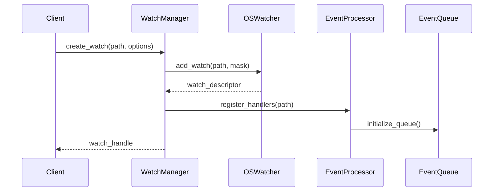
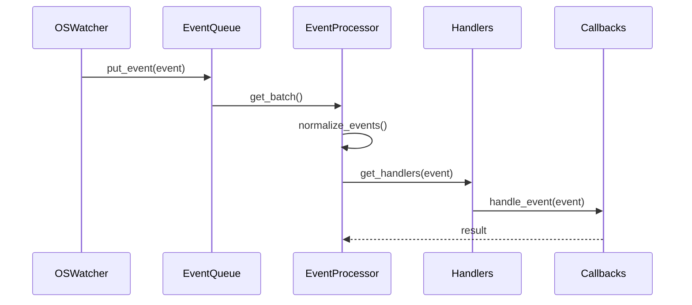

# File Watching System Design

## System Overview

### Purpose
Design a reliable and efficient file watching system that monitors and reports file system changes while maintaining low resource usage and high responsiveness.

### Scope
- File system event monitoring
- Change detection and notification
- Resource management
- Event processing

## Architecture

### High-Level Component Diagram
```
┌────────────────────────────────────┐
│         File Watch System          │
└──────────────────┬─────────────────┘
         ┌─────────┴─────────┐
         ▼                   ▼
┌─────────────────┐   ┌──────────────────┐
│  Watch Manager  │   │  Event Processor  │
└───────┬─────────┘   └────────┬─────────┘
        │                      │
    ┌───┴──────────────────────┴───┐
    ▼                              ▼
┌─────────┐                  ┌──────────┐
│ OS      │                  │ Event    │
│ Watcher │                  │ Queue    │
└────┬────┘                  └────┬─────┘
     │                            │
     └────────────────────────────┘
```

## Component Design

### 1. Watch Manager
```python
class WatchManager:
    def __init__(self):
        self.watchers: Dict[str, FileWatcher] = {}
        self.event_processor = EventProcessor()
        self.os_watcher = OSWatcher()
        
    async def create_watch(
        self,
        path: str,
        options: WatchOptions
    ) -> WatchHandle:
        """
        Create a new file system watch.
        """
        try:
            # Validate path and options
            self._validate_watch_request(path, options)
            
            # Create watcher if doesn't exist
            if path not in self.watchers:
                watcher = await self._create_watcher(path, options)
                self.watchers[path] = watcher
            
            # Register callback
            handle = self.watchers[path].add_callback(
                options.callback
            )
            
            return handle
            
        except WatchError as e:
            await self._handle_watch_error(e)

    def remove_watch(
        self,
        handle: WatchHandle
    ) -> bool:
        """
        Remove an existing watch.
        """
        try:
            watcher = self._get_watcher(handle)
            watcher.remove_callback(handle)
            
            # Clean up watcher if no callbacks remain
            if not watcher.has_callbacks():
                self._cleanup_watcher(watcher)
                
            return True
            
        except WatchError as e:
            self._handle_watch_error(e)
            return False
```

### 2. Event Processor
```python
class EventProcessor:
    def __init__(self):
        self.queue = EventQueue()
        self.handlers = EventHandlerRegistry()
        self._running = False

    async def start(self):
        """
        Start processing events.
        """
        self._running = True
        await self._process_events()

    async def _process_events(self):
        """
        Main event processing loop.
        """
        while self._running:
            try:
                # Get batch of events
                events = await self.queue.get_batch(
                    max_size=100,
                    timeout=0.1
                )
                
                # Process events
                for event in events:
                    await self._process_single_event(event)
                    
            except EventProcessingError as e:
                await self._handle_processing_error(e)

    async def _process_single_event(
        self,
        event: FileEvent
    ):
        """
        Process a single file system event.
        """
        # Normalize event
        normalized = self._normalize_event(event)
        
        # Find handlers
        handlers = self.handlers.get_handlers(normalized)
        
        # Execute handlers
        for handler in handlers:
            try:
                await handler.handle(normalized)
            except Exception as e:
                await self._handle_handler_error(e, handler)
```

### 3. OS Watcher
```python
class OSWatcher:
    def __init__(self):
        self.platform_watcher = self._create_platform_watcher()
        self.watch_descriptors: Dict[str, Any] = {}

    def _create_platform_watcher(self):
        """
        Create platform-specific watcher.
        """
        if sys.platform == 'win32':
            return WindowsWatcher()
        elif sys.platform == 'linux':
            return LinuxWatcher()
        elif sys.platform == 'darwin':
            return MacOSWatcher()
        else:
            raise UnsupportedPlatformError()

    async def add_watch(
        self,
        path: str,
        mask: int
    ) -> WatchDescriptor:
        """
        Add a new watch at OS level.
        """
        try:
            descriptor = await self.platform_watcher.add_watch(
                path, mask
            )
            self.watch_descriptors[path] = descriptor
            return descriptor
            
        except OSError as e:
            raise WatchError(f"Failed to add watch: {e}")
```

### 4. Event Queue
```python
class EventQueue:
    def __init__(self, max_size: int = 10000):
        self.queue = asyncio.Queue(max_size)
        self.batch_size = 100
        self.stats = QueueStats()

    async def put_event(
        self,
        event: FileEvent
    ) -> bool:
        """
        Add event to queue with overflow protection.
        """
        try:
            await self.queue.put_nowait(event)
            self.stats.record_enqueue()
            return True
            
        except asyncio.QueueFull:
            self.stats.record_overflow()
            return False

    async def get_batch(
        self,
        max_size: int,
        timeout: float
    ) -> List[FileEvent]:
        """
        Get batch of events from queue.
        """
        events = []
        try:
            while len(events) < max_size:
                event = await asyncio.wait_for(
                    self.queue.get(),
                    timeout
                )
                events.append(event)
                self.queue.task_done()
                
        except asyncio.TimeoutError:
            pass
            
        return events
```

## Data Flow

### Watch Creation Flow


### Event Processing Flow


## Error Handling

### Error Hierarchy
```
WatchError
├── WatchCreationError
│   ├── PathError
│   └── ResourceError
├── WatchProcessingError
│   ├── QueueError
│   └── HandlerError
└── SystemError
    ├── PlatformError
    └── ResourceError
```

### Recovery Strategies
1. **Watch Failures**
   - Automatic retry
   - Fallback methods
   - Graceful degradation

2. **Queue Overflow**
   - Event dropping
   - Priority processing
   - Back-pressure

## Performance Optimizations

### 1. Event Batching
- Batch processing
- Event coalescing
- Priority queuing
- Delayed processing

### 2. Resource Management
- Watch pooling
- Handler caching
- Memory limits
- CPU throttling

### 3. Event Filtering
- Path filtering
- Event debouncing
- Duplicate elimination
- Pattern matching

## Monitoring

### Key Metrics
1. **Watch Statistics**
   - Active watches
   - Event frequency
   - Resource usage
   - Error rates

2. **Queue Metrics**
   - Queue size
   - Processing time
   - Overflow count
   - Batch statistics

### Implementation
```python
class WatchMetrics:
    def __init__(self):
        self.metrics = MetricsCollector()
        self.logger = MetricsLogger()

    def record_watch_metrics(
        self,
        metrics: Dict[str, Any]
    ):
        """
        Record watch-related metrics.
        """
        self.metrics.record(metrics)
        self.logger.log_metrics(metrics)

    def generate_report(self) -> MetricsReport:
        """
        Generate metrics report.
        """
        return self.metrics.generate_report()
```

This high-level design provides a foundation for implementing a robust and efficient file watching system while maintaining modularity and extensibility.
