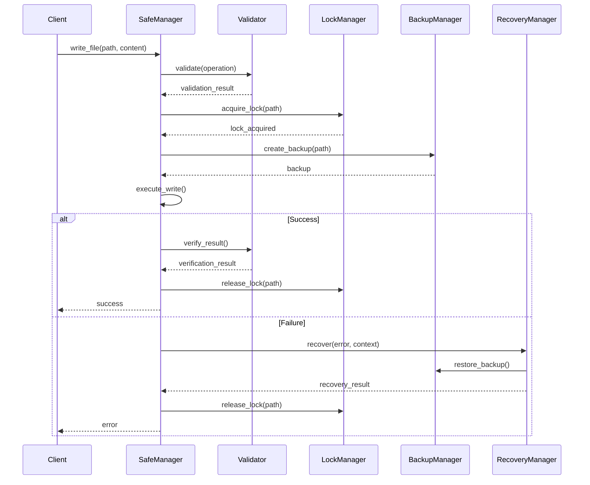

# Safe File Operations Design

## System Overview

### Purpose
Design a robust and secure file operation system that ensures data integrity, prevents unauthorized access, and maintains system stability during file operations.

### Scope
- File operation safety
- Backup management
- Concurrency control
- Error recovery

## Architecture

### High-Level Component Diagram
```
┌────────────────────────────────────┐
│      Safe Operations Manager       │
└──────────────────┬─────────────────┘
         ┌─────────┴─────────┐
         ▼                   ▼
┌─────────────────┐   ┌──────────────────┐
│   Validator     │   │  Backup Manager  │
└───────┬─────────┘   └────────┬─────────┘
        │                      │
    ┌───┴──────────────────────┴───┐
    ▼                              ▼
┌─────────┐                  ┌──────────┐
│ Lock    │                  │ Recovery │
│ Manager │                  │ Manager  │
└────┬────┘                  └────┬─────┘
     │                            │
     └────────────────────────────┘
```

## Component Design

### 1. Safe Operations Manager
```python
class SafeOperationsManager:
    def __init__(self):
        self.validator = Validator()
        self.backup_manager = BackupManager()
        self.lock_manager = LockManager()
        self.recovery_manager = RecoveryManager()

    async def execute_operation(
        self,
        operation: FileOperation
    ) -> OperationResult:
        """
        Execute file operation with safety protocols.
        """
        try:
            # Validate operation
            await self.validator.validate(operation)
            
            # Acquire lock
            async with self.lock_manager.lock(operation.path):
                # Create backup
                backup = await self.backup_manager.create_backup(
                    operation.path
                )
                
                try:
                    # Execute operation
                    result = await operation.execute()
                    
                    # Verify result
                    if not await self.validator.verify_result(result):
                        raise OperationError("Verification failed")
                    
                    return result
                    
                except Exception as e:
                    # Restore from backup
                    await self.recovery_manager.restore(backup)
                    raise OperationError(f"Operation failed: {e}")
                    
        except Exception as e:
            await self._handle_operation_error(e)
```

### 2. Validator
```python
class Validator:
    def __init__(self):
        self.path_validator = PathValidator()
        self.permission_validator = PermissionValidator()
        self.content_validator = ContentValidator()

    async def validate(
        self,
        operation: FileOperation
    ) -> ValidationResult:
        """
        Validate operation safety.
        """
        # Validate path
        path_result = await self.path_validator.validate(
            operation.path
        )
        
        # Validate permissions
        perm_result = await self.permission_validator.validate(
            operation.path,
            operation.type
        )
        
        # Validate content if applicable
        content_result = None
        if operation.has_content():
            content_result = await self.content_validator.validate(
                operation.content
            )
            
        return ValidationResult(
            path_result,
            perm_result,
            content_result
        )
```

### 3. Backup Manager
```python
class BackupManager:
    def __init__(self):
        self.storage = BackupStorage()
        self.version_manager = VersionManager()

    async def create_backup(
        self,
        path: str
    ) -> Backup:
        """
        Create file backup before operation.
        """
        try:
            # Generate backup metadata
            metadata = await self._create_metadata(path)
            
            # Create backup copy
            backup_path = await self.storage.store(
                path,
                metadata
            )
            
            # Register version
            version = await self.version_manager.register(
                backup_path,
                metadata
            )
            
            return Backup(backup_path, version, metadata)
            
        except BackupError as e:
            await self._handle_backup_error(e)

    async def restore_backup(
        self,
        backup: Backup
    ) -> bool:
        """
        Restore from backup.
        """
        try:
            # Verify backup integrity
            if not await self.storage.verify(backup):
                raise BackupError("Backup integrity check failed")
                
            # Perform restore
            await self.storage.restore(
                backup.path,
                backup.metadata
            )
            
            return True
            
        except BackupError as e:
            await self._handle_restore_error(e)
            return False
```

### 4. Lock Manager
```python
class LockManager:
    def __init__(self):
        self.locks: Dict[str, asyncio.Lock] = {}
        self.timeout = 30  # seconds

    async def acquire_lock(
        self,
        path: str,
        timeout: Optional[float] = None
    ) -> bool:
        """
        Acquire operation lock with timeout.
        """
        try:
            lock = self._get_or_create_lock(path)
            return await asyncio.wait_for(
                lock.acquire(),
                timeout or self.timeout
            )
        except asyncio.TimeoutError:
            raise LockError(f"Lock acquisition timeout: {path}")

    def release_lock(self, path: str):
        """
        Release operation lock.
        """
        if path in self.locks:
            self.locks[path].release()
            self._cleanup_lock(path)
```

### 5. Recovery Manager
```python
class RecoveryManager:
    def __init__(self):
        self.backup_manager = BackupManager()
        self.state_manager = StateManager()

    async def recover(
        self,
        error: OperationError,
        context: OperationContext
    ) -> RecoveryResult:
        """
        Handle operation failure and recovery.
        """
        try:
            # Log error
            await self._log_error(error, context)
            
            # Restore backup if available
            if context.has_backup():
                await self.backup_manager.restore_backup(
                    context.backup
                )
            
            # Restore system state
            await self.state_manager.restore(context)
            
            return RecoveryResult(
                success=True,
                restored_path=context.path
            )
            
        except RecoveryError as e:
            await self._handle_recovery_error(e)
            return RecoveryResult(success=False)
```

## Operation Flow

### Safe Write Operation


## Error Handling

### Error Hierarchy
```
SafeOperationError
├── ValidationError
│   ├── PathError
│   ├── PermissionError
│   └── ContentError
├── LockError
│   ├── TimeoutError
│   └── DeadlockError
├── BackupError
│   ├── StorageError
│   └── VersionError
└── RecoveryError
    ├── RestoreError
    └── StateError
```

### Recovery Strategies
1. **Operation Failure**
   - Backup restoration
   - Lock release
   - State recovery
   - Error notification

2. **System Failure**
   - Emergency cleanup
   - Lock breaking
   - State reset
   - Admin notification

## Performance Optimizations

### 1. Lock Management
- Lock pooling
- Timeout optimization
- Deadlock detection
- Priority handling

### 2. Backup Strategy
- Incremental backups
- Compression
- Async storage
- Cleanup policies

### 3. Validation
- Cache validation results
- Parallel validation
- Early termination
- Rule optimization

## Monitoring

### Key Metrics
1. **Operation Metrics**
   - Success rate
   - Response time
   - Lock contention
   - Recovery rate

2. **Resource Usage**
   - Lock duration
   - Backup size
   - Memory usage
   - CPU utilization

### Implementation
```python
class SafetyMetrics:
    def __init__(self):
        self.metrics = MetricsCollector()
        self.logger = OperationLogger()

    def record_operation(
        self,
        operation: FileOperation,
        result: OperationResult
    ):
        """
        Record operation metrics.
        """
        self.metrics.record({
            'operation_type': operation.type,
            'duration': result.duration,
            'success': result.success,
            'recovery_needed': result.recovered,
            'resource_usage': result.resources
        })

    def generate_report(self) -> MetricsReport:
        """
        Generate safety metrics report.
        """
        return self.metrics.generate_report()
```

This high-level design provides a foundation for implementing robust and secure file operations while maintaining system stability and data integrity.
