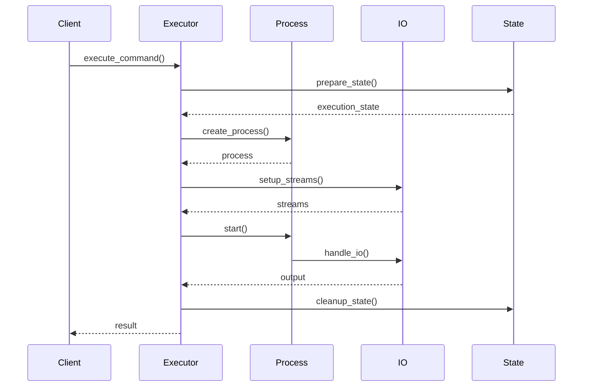
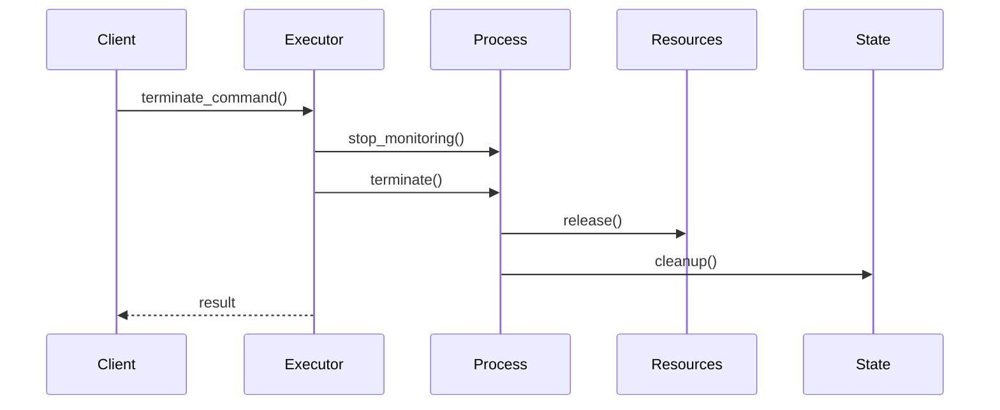

# Shell Command Interface Design

## System Overview

### Purpose
Design a robust and flexible shell command interface that enables secure command execution while providing rich functionality and efficient resource management.

### Scope
- Command execution
- Process management
- I/O handling
- State management

## Architecture

### High-Level Component Diagram
```
┌────────────────────────────────────┐
│       Shell Command System         │
└──────────────────┬─────────────────┘
         ┌─────────┴─────────┐
         ▼                   ▼
┌─────────────────┐   ┌──────────────────┐
│Command Executor │   │Process Manager   │
└───────┬─────────┘   └────────┬─────────┘
        │                      │
    ┌───┴──────────────────────┴───┐
    ▼                              ▼
┌─────────┐                  ┌──────────┐
│ I/O     │                  │ State    │
│ Manager │                  │ Manager  │
└────┬────┘                  └────┬─────┘
     │                            │
     └────────────────────────────┘
```

## Component Design

### 1. Command Executor
```python
class CommandExecutor:
    def __init__(self):
        self.process_manager = ProcessManager()
        self.io_manager = IOManager()
        self.state_manager = StateManager()

    async def execute_command(
        self,
        command: ShellCommand,
        options: ExecutionOptions
    ) -> ExecutionResult:
        """
        Execute shell command.
        """
        try:
            # Validate command
            await self._validate_command(command)
            
            # Create process
            process = await self.process_manager.create_process(
                command, options
            )
            
            # Setup I/O
            streams = await self.io_manager.setup_streams(
                process, options
            )
            
            # Execute
            result = await self._execute_process(
                process, streams
            )
            
            return result
            
        except ExecutionError as e:
            await self._handle_execution_error(e)

    async def _execute_process(
        self,
        process: Process,
        streams: IOStreams
    ) -> ExecutionResult:
        """
        Execute process with I/O handling.
        """
        try:
            # Start process
            await process.start()
            
            # Handle I/O
            output = await self.io_manager.handle_io(
                streams, process
            )
            
            # Wait for completion
            exit_code = await process.wait()
            
            return ExecutionResult(
                exit_code=exit_code,
                output=output
            )
            
        finally:
            await self._cleanup(process, streams)
```

### 2. Process Manager
```python
class ProcessManager:
    def __init__(self):
        self.processes = ProcessRegistry()
        self.resource_manager = ResourceManager()
        self.monitor = ProcessMonitor()

    async def create_process(
        self,
        command: ShellCommand,
        options: ExecutionOptions
    ) -> Process:
        """
        Create new process.
        """
        try:
            # Allocate resources
            resources = await self.resource_manager.allocate(
                command.requirements
            )
            
            # Create process
            process = await self._create_process_instance(
                command, options, resources
            )
            
            # Register process
            self.processes.register(process)
            
            # Start monitoring
            await self.monitor.start_monitoring(process)
            
            return process
            
        except ProcessError as e:
            await self._handle_process_error(e)

    async def terminate_process(
        self,
        process: Process,
        force: bool = False
    ) -> bool:
        """
        Terminate running process.
        """
        try:
            # Stop monitoring
            await self.monitor.stop_monitoring(process)
            
            # Terminate process
            success = await process.terminate(force)
            
            # Cleanup resources
            await self.resource_manager.release(
                process.resources
            )
            
            # Unregister process
            self.processes.unregister(process)
            
            return success
            
        except ProcessError as e:
            await self._handle_termination_error(e)
```

### 3. I/O Manager
```python
class IOManager:
    def __init__(self):
        self.stream_manager = StreamManager()
        self.buffer_manager = BufferManager()
        self.formatter = OutputFormatter()

    async def setup_streams(
        self,
        process: Process,
        options: ExecutionOptions
    ) -> IOStreams:
        """
        Setup process I/O streams.
        """
        try:
            # Create streams
            stdin = await self.stream_manager.create_input_stream(
                options.input
            )
            stdout = await self.stream_manager.create_output_stream(
                options.output
            )
            stderr = await self.stream_manager.create_error_stream(
                options.error
            )
            
            # Setup buffers
            await self.buffer_manager.setup_buffers(
                stdin, stdout, stderr
            )
            
            return IOStreams(stdin, stdout, stderr)
            
        except StreamError as e:
            await self._handle_stream_error(e)

    async def handle_io(
        self,
        streams: IOStreams,
        process: Process
    ) -> ExecutionOutput:
        """
        Handle process I/O.
        """
        try:
            # Start I/O handlers
            input_task = self._handle_input(
                streams.stdin, process
            )
            output_task = self._handle_output(
                streams.stdout, process
            )
            error_task = self._handle_error(
                streams.stderr, process
            )
            
            # Wait for completion
            results = await asyncio.gather(
                input_task,
                output_task,
                error_task,
                return_exceptions=True
            )
            
            # Format output
            return await self.formatter.format_output(results)
            
        except IOError as e:
            await self._handle_io_error(e)
```

### 4. State Manager
```python
class StateManager:
    def __init__(self):
        self.environment = EnvironmentManager()
        self.working_dir = WorkingDirManager()
        self.session = SessionManager()

    async def prepare_execution(
        self,
        command: ShellCommand,
        options: ExecutionOptions
    ) -> ExecutionState:
        """
        Prepare execution state.
        """
        try:
            # Setup environment
            env = await self.environment.setup(
                command.environment
            )
            
            # Set working directory
            cwd = await self.working_dir.set(
                command.working_dir
            )
            
            # Create session
            session = await self.session.create(
                command, options
            )
            
            return ExecutionState(env, cwd, session)
            
        except StateError as e:
            await self._handle_state_error(e)

    async def cleanup_state(
        self,
        state: ExecutionState
    ):
        """
        Cleanup execution state.
        """
        try:
            # Restore environment
            await self.environment.restore(state.env)
            
            # Restore working directory
            await self.working_dir.restore(state.cwd)
            
            # Cleanup session
            await self.session.cleanup(state.session)
            
        except StateError as e:
            await self._handle_cleanup_error(e)
```

## Command Flow

### Execution Flow


### Termination Flow


## Error Handling

### Error Hierarchy
```
ShellError
├── ExecutionError
│   ├── ProcessError
│   └── ResourceError
├── IOError
│   ├── StreamError
│   └── BufferError
└── StateError
    ├── EnvironmentError
    └── SessionError
```

### Recovery Strategies
1. **Process Failures**
   - Process restart
   - Resource cleanup
   - State restoration
   - Error notification

2. **I/O Failures**
   - Stream reset
   - Buffer cleanup
   - Data recovery
   - Connection retry

## Performance Optimizations

### 1. Process Management
- Process pooling
- Resource caching
- State reuse
- Lazy allocation

### 2. I/O Management
- Stream buffering
- Async I/O
- Data batching
- Memory mapping

### 3. State Management
- Environment caching
- Path resolution
- Session pooling
- Context reuse

## Monitoring

### Key Metrics
1. **Execution Metrics**
   - Command success rate
   - Process lifetime
   - Resource usage
   - Response time

2. **System Metrics**
   - Process count
   - Memory usage
   - I/O throughput
   - State changes

### Implementation
```python
class ShellMetrics:
    def __init__(self):
        self.metrics = MetricsCollector()
        self.logger = MetricsLogger()

    def record_shell_metrics(
        self,
        metrics: Dict[str, Any]
    ):
        """
        Record shell operation metrics.
        """
        self.metrics.record(metrics)
        self.logger.log_metrics(metrics)

    def generate_report(self) -> MetricsReport:
        """
        Generate metrics report.
        """
        return self.metrics.generate_report()
```

This high-level design provides a foundation for implementing a robust and efficient shell command interface while maintaining system stability and performance.
